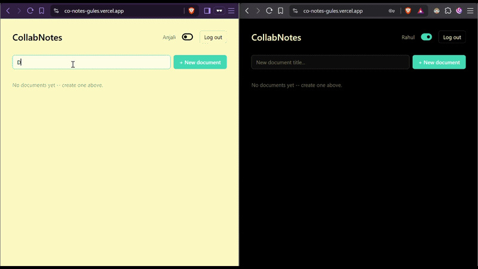
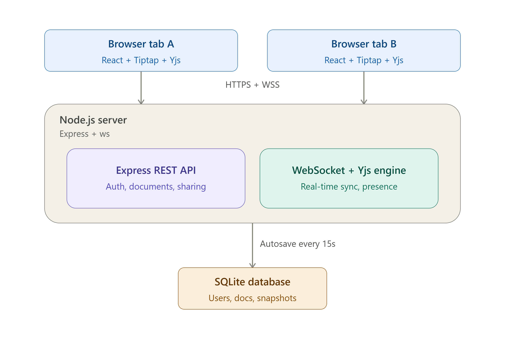

# CoNotes

A real-time collaborative note-taking app — think Google Docs, simplified. Multiple people can edit the same document at once, see each other's live cursors, and roll back to earlier versions.

**Live demo:** https://co-notes-gules.vercel.app
**Backend health check:** https://conotes-server.onrender.com/health

> ⚠️ The backend is hosted on Render's free tier, which spins down after ~15 minutes of inactivity. The first request after a period of idleness can take 30-60 seconds to wake it back up. If you're testing this live, hit the health check link above first to warm it up.

---

## Demo



*(demo — two browser windows side by side, typing simultaneously, showing live cursors and presence)*

---

## What it does

- **Auth** — email/password signup and login, JWT-based sessions
- **Create & manage documents** — a personal dashboard listing everything you own or have been given access to
- **Share documents** — invite collaborators by email
- **Real-time collaborative editing** — type in one browser, see it appear instantly in every other connected browser, with automatic conflict-free merging when multiple people type at once
- **Live presence** — see who else is currently viewing/editing the document
- **Live cursors** — see exactly where each collaborator's cursor is, labeled with their name
- **Autosave** — document state is persisted to the database automatically every 15 seconds, no manual save needed
- **Version history** — periodic snapshots of the document are saved, browsable, and restorable

---

## Architecture



```

- **Frontend:** React + Vite, [Tiptap](https://tiptap.dev/) (rich text editor built on ProseMirror), Tailwind CSS for styling, React Router for navigation
- **Real-time sync:** [Yjs](https://docs.yjs.dev/) (CRDT library) + `y-websocket` (WebSocket transport + presence/awareness protocol)
- **Backend:** Node.js + Express for the REST API, `ws` for the raw WebSocket server
- **Database:** SQLite (via `better-sqlite3`) — zero external services to set up, runs anywhere
- **Auth:** JWT, verified on both REST requests (Express middleware) and WebSocket connections (during the HTTP upgrade handshake)
- **Deployment:** Backend on Render, frontend on Vercel

### How real-time editing actually works

Each open document is represented as one `Y.Doc` (a CRDT data structure) living in server memory. Every browser tab editing that document opens a WebSocket connection and syncs against that same `Y.Doc`. Tiptap's `Collaboration` extension is configured to read/write directly into the shared `Y.Doc` instead of managing its own local state — so every keystroke becomes a Yjs operation that gets broadcast to every other connected client and merged automatically.

Presence and live cursors use Yjs's separate "awareness" protocol — ephemeral state (name, color, cursor position) that's broadcast the same way as document edits but is never persisted to the database. It simply disappears when a client disconnects.

Every 15 seconds, a background loop sweeps all open documents, persists their latest state to SQLite (autosave), and — every 60 seconds — writes a timestamped snapshot for version history. Restoring an old version is implemented as a *new edit* that clears the current content and re-inserts the snapshot's content, rather than trying to "rewind" the CRDT directly — Yjs state only ever merges forward, so a true rewind isn't something the data structure supports; treating restore as a normal mergeable operation is the correct way to work with that constraint.

---

## Why Yjs (CRDT) instead of Operational Transformation

Google Docs' original collaborative editing engine uses Operational Transformation (OT) — a technique for resolving conflicting concurrent edits by transforming each operation against every other operation that happened concurrently. It works, but it's notoriously difficult to implement correctly; subtle bugs in OT transform functions can silently corrupt documents, and Google has published multiple papers refining their approach over the years.

CRDTs (Conflict-free Replicated Data Types) take a different approach: the data structure itself is designed so that any two divergent copies of it merge back into an identical result, regardless of the order updates are applied in — no custom transform logic required. Yjs is a mature, widely-used CRDT implementation with a pre-built WebSocket provider and awareness protocol, which meant the hardest distributed-systems problem in this project was solved by a well-tested library.

---

## Project structure

```
.
├── server/
│   ├── src/
│   │   ├── index.js       # Entry point — wires up Express + WebSocket on one HTTP server
│   │   ├── db.js          # SQLite schema (users, documents, document_access, snapshots)
│   │   ├── auth.js        # Signup/login routes + JWT middleware
│   │   ├── documents.js   # Document CRUD, sharing, version history routes
│   │   └── ws.js          # The real-time engine: Yjs doc management, WebSocket auth,
│   │                      # presence, autosave, snapshotting, version restore
│   └── .env.example
│
└── client/
    ├── src/
    │   ├── api.js                        # Fetch wrapper with auth token handling
    │   ├── App.jsx                       # Routes
    │   ├── pages/
    │   │   ├── Login.jsx
    │   │   ├── Signup.jsx
    │   │   ├── Dashboard.jsx             # List/create/share documents
    │   │   └── Editor.jsx                # The collaborative editor (Tiptap + Yjs + WebSocket)
    │   └── components/
    │       ├── PresenceBar.jsx           # Online-user chips
    │       └── VersionHistory.jsx        # Snapshot list + restore
    └── .env.example
```

---

## Running it locally

### Backend

```bash
cd server
npm install
cp .env.example .env   # then fill in a real JWT_SECRET
npm run dev
```

Generate a real secret with:
```bash
node -e "console.log(require('crypto').randomBytes(32).toString('hex'))"
```

The server runs on `http://localhost:4000`.

### Frontend

```bash
cd client
npm install
cp .env.example .env   # defaults point at localhost:4000, no changes needed for local dev
npm run dev
```

The app runs on `http://localhost:5173`.

### Try it

1. Sign up two separate accounts (e.g. in a normal window and an incognito window)
2. Create a document with the first account
3. Share it with the second account's email from the dashboard
4. Open the same document in both windows and start typing — changes should appear instantly in both, with live cursors and presence chips for each user

---

## Known limitations / what I'd build next

- **Cursor anchoring during concurrent typing at the same position** — if User A's cursor is sitting exactly where User B is actively typing, A's cursor visually appears to "follow along" as B types. This is expected CRDT behavior (cursors are anchored to relative positions in the shared text, not fixed pixels), and the same thing happens in most production collaborative editors — but it's worth calling out since it can look unusual the first time you see it.
- **Version history is snapshot-based, not a true diff/timeline** — restoring replaces the whole document rather than showing a change-by-change history. A more complete version would track individual Yjs updates for a scrubbable timeline.
- **SQLite + free-tier hosting** — fine for a demo, but production disk on most free hosting tiers is ephemeral; a real deployment would use a managed database (Postgres) and persistent storage.
- **Sharing UX** — currently uses a browser `prompt()` for simplicity. A real version would have a proper share modal with a list of current collaborators and the ability to change/revoke access.
- **Sharing is editor-only right now** — the database schema and share API both accept a `role` field (`editor`/`viewer`), but the dashboard's share flow always sends `role: 'editor'` and never asks the user to choose. So in practice, every collaborator you share with today gets full edit access — there's no way to grant view-only access yet. Finishing this would mean adding a role picker to the share UI, and then actually enforcing `viewer` as read-only in both the WebSocket access check and the Tiptap editor itself.

---

## Tech stack summary

| Layer | Technology |
|---|---|
| Frontend framework | React + Vite |
| Rich text editor | Tiptap (ProseMirror) |
| Real-time sync | Yjs (CRDT) + y-websocket |
| Styling | Tailwind CSS |
| Routing | React Router |
| Backend framework | Express |
| Real-time transport | `ws` (raw WebSocket server) |
| Database | SQLite (`better-sqlite3`) |
| Auth | JWT (`jsonwebtoken`, `bcryptjs`) |
| Backend hosting | Render |
| Frontend hosting | Vercel |